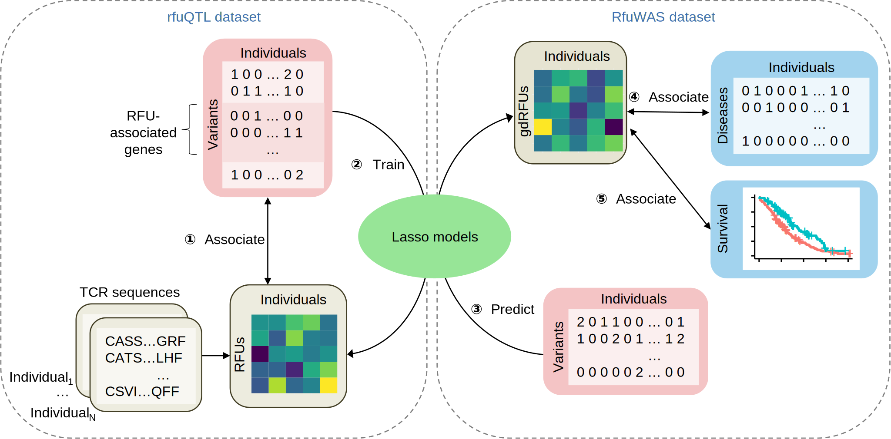

# Interpretable GWAS by linking clinical phenotypes to quantifiable immune repertoire components
We investigate the quantitative components in the T cell receptor (TCR) repertoire to interpret the genetic associations of diverse human diseases. We first proposed the concept of RFU quantitative trait locus (rfuQTL) which examines the associations between genetic variants and RFU abundances. We then developed a lasso-based model to predict RFU abundances based on genetic variants. Subsequently, we applied this model within UK Biobank to predict RFU abundances and investigated their associations with diseases and cancer survival outcomes through RFU-wide association studies (RfuWAS).
